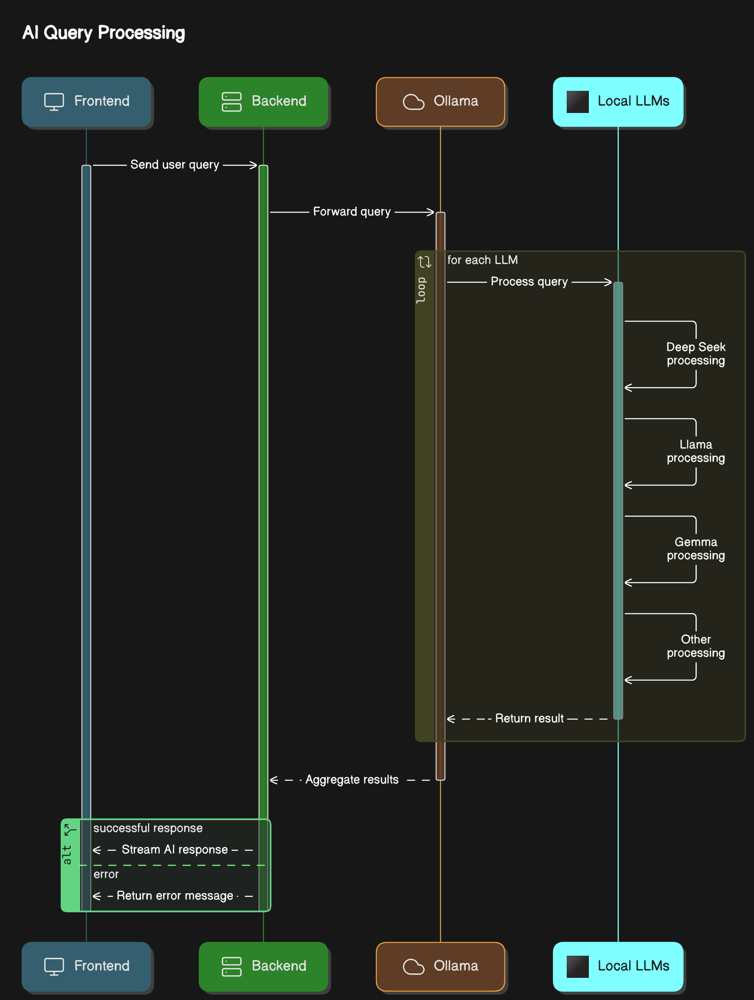

# LocAI - Local AI Chat Interface 🤖

A lightweight and efficient chat interface for interacting with local AI models through Ollama.



## 🚀 Features

- **Multiple LLM Support**: Compatible with various models:
  - Llama 2 (3B parameters)
  - Phi (2.7B parameters)
  - Gemma (2B parameters)
  - Deepseek (1.5B parameters)

- **Real-time Streaming**: Instant responses with text streaming
- **Intuitive UI**: Clean interface with modern design
- **Cross Platform**: Works on Windows, macOS, and Linux

## 🛠️ Tech Stack

- Frontend: React.js + Bootstrap
- Backend: Flask + Python
- AI: Ollama

## 📦 Prerequisites

```bash
# Install Ollama
curl https://ollama.ai/install.sh | sh

# Install required models
ollama pull llama2:3b
ollama pull phi:2.7b
ollama pull gemma:2b
ollama pull deepseek:1.5b
```

## 🔧 Installation

```bash
# Clone repository
git clone https://github.com/yourusername/locai.git
cd locai

# Install backend dependencies
cd backend
pip install -r requirements.txt

# Install frontend dependencies
cd ../frontend
npm install
```

## 🚀 Usage

```bash
# Start backend server
cd backend
python main.py

# Start frontend development server
cd frontend
npm start
```

## 💬 Chat Interface

### Features:
- 📝 Multi-line input support
- 🔄 Real-time response streaming
- ⚡ Quick model switching
- 🎨 Markdown rendering
- 🛑 Stop generation option
- 🗑️ Clear chat history

### Commands:
- **Send Message**: Enter or Ctrl+Enter
- **Stop Generation**: Stop button
- **Clear Chat**: Clear button
- **Switch Model**: Select from sidebar

## 🔐 Privacy

All processing happens locally on your machine - no data is sent to external servers.

## 🤝 Contributing

Pull requests are welcome! For major changes, please open an issue first.

---
Built with ❤️ using React and Flask